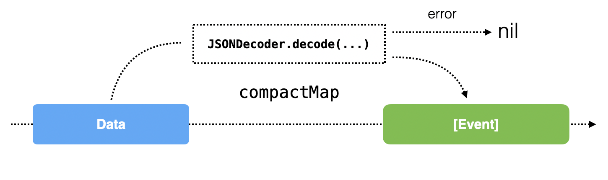

# 8장 Transforming Operators in Practice

이전 장에서 반응형 프로그래밍의 진정한 일꾼 map & flatMap 을 살펴봤다. 이 둘이 옵저버블을 변환하는 유일한 연산자는 아니지만 최소한 몇번이라도 써야한다. 이 둘을 잘 다루면 코드가 훨씬 발전할것임

&nbsp;

이번엔 non-Rx 코드로 만들어진 앱을 map과 flatMap을 이용해서 리팩토링 하면서 심화학습해보자.

&nbsp;

[TOC]

&nbsp;

## 1. GitFeed 앱

RxSwift 깃 레포지토리의 최신 활동들을 불러와서 표시하는 앱이며 주 기능 두 가지(메인-서브)가 있다.

* 메인-깃허브 JSON API에 요청 뒤 JSON response를 받아서 콜렉션으로 변환하기
* 서브-불러온 오브젝트를 디스크에 저장하고 서버에서 불러온 활동 이벤트 리스트 갱신 전에 테이블뷰에 보여주기 

&nbsp;

&nbsp;

## 2. Fetching data from the web

이전에 URLSession을 사용한 적이 있고 동작 원리를 알고 있길 바란다. 요약: web URL과 파라미터를 포함하는 URLRequest를 만든 다음 인터넷으로 보낸다. 잠시 후 서버 response를 받는다.

&nbsp;

현재 RxSwift지식으로ㅡ URLSession 클래스에 반응형 확장을 추가하는건 어렵다. 나중에 커스텀 반응형 확장을 추가하는걸 배우겠지만 이번 장에선 간단히 RxSwift의 동반 라이브러리인 RxCocoa에서 제공하는 솔루션을 쓰자.

&nbsp;

Rxcocoa는 RxSwift에 기반한 라이브러리인데 애플 프랫폼에서 RxSwift에 대한 개발을 돕는 많은 유용한 APIs들을 구현한다. RxSwift 자체를 RxJS, RxJava, RxPython 같은 구현들이 공유하는 공통 Rx API에 가깝게 유지하기위한 노력으로 모든 "그 외 기능" 들은 RxCocoa로 분리되었다. 추후 자세히 다루겠다.


깃허브 API로 JSON을 빠르게 가져오기 위해 이번 장에서는 기본 RxCocoa URLSession 확장을 사용할 것임

&nbsp;

### Using map to build a request

첫 번째로 할 작업은 깃허브 서버로 보낼 URLRequest를 생성하는 것임. 반응형적으로 접근하기 때문에 처음에는 이해가 안될 수도 있지만 잠시 후 다시 보면 의미를 파악 할 수 있을거다.

&nbsp;

```swift
private let repo = "ReactiveX/RxSwift"

let response = Observable.from([repo])
```

web request를 만드는데 레포지토리 이름 string으로 시작하는 이유는 레포지토리 이름을 바꾸고 싶을 때를 대비해서 유연성을 가져가기 위함

&nbsp;

다음으로 레포지토리 주소를 받아서 활동 API 엔드포인트의 완전한 URL을 만들자.

```swift
.map { urlString -> URL in
  return URL(string: "https://api.github.com/repos/\(urlString)/events")!
}
```

완전한 URL을 만들기위해 하드코딩, 강제 추출 등 몇가지 편법을 쓰겠음. 결국 최신 이벤트의 JSON 데이터에 접근하기 위한 URL을 갖게 되었다. 클로저의 아웃풋 타입이 특정되어있는 것을 눈치 챘는가? 그래야만 할까? 분명한 답은 '아니다'이다. 대게 클로저의 인풋 아웃풋 타입을 명시할 필요는 없다. 대게 컴파일러가 추론하도록 남겨놓을 수 있다.

&nbsp;

그런데, 특히 여러 map과 flatMap 연산자가 함께 연결된 코드에서, 컴파일러를 도와줘야 한다. 컴파일러는 때때로 적절한 타입을 찾는데 실패할거다. 최소한 아웃풋 타입을 명시해서 컴파일러를 도울 수 있다. 만약 타입 mismatch나 missing 에러를 보면 클로저에 타입 정보를 추가할 수 있고 문제가 해결 될 거다.

&nbsp;

이제 URL이 있으니, 완전한 요청으로 변환 할 수 있다. 마지막 연산자에 연결하자.

```swift
.map { url -> URLRequest in
  return URLRequest(url: url)
}
```

map을 사용해서 제공된 웹 주소로 URL을 URLRequest로 변환했다.

복잡한 변환을 생성하기 위해 몇개의 map 연산자를 연결했다.


이제 flatMap을 사용해서 JSON 데이터를 가져와보자.

&nbsp;

### Using flatMap to wait for a web response

이전 장에서 flatMap이 옵저버블 시퀀스를 평면화 한다고 배웠다. flatMap의 일반적인 응용 중 하나는 변환 연결에 비동기성을 추가하는 것이다. 

&nbsp;

몇개의 변환(transformation)을 연결 할 때 작업은 동기적으로 일어난다. 말하자면, 모든 변환 연산자는 그들의 아웃풋을 즉시 실행한다.


이 연결 사이에 flatMap을 삽입하면 다양한 효과를 얻을 수 있다.

* string이나 int형 배열로 만든 옵저버블 같이 요소를 즉시 방출하고 완료하는 옵저버블을 평면화 할 수 있다. 
* 일부 비동기 작업을 수행하고 옵저버블이 완료될 때 까지 효과적으로 대기하는 옵저버블을 평면화 할 수 있고 그런 다음에만 나머지 연결 작업이 동작하도록 할 수 있습니다.

&nbsp;

GifFeed에서는 다음과 같은 동작이 필요하다.


그러기 위해 다음 코드를 마지막 연산자 체인에 추가하자.

```swift
.flatMap { request -> Observable<(response: HTTPURLResponse, data: Data)> in
  return URLSession.shared.rx.response(request: request)
}
```

shared URLSession에 RxCocoa의 response(request:) 메소드를 쓰자. 메소드는 앱이 웹 서버로부터 전체 응답을 받을 때마다 완료되는 Observable<(response: HTTPURLResponse, data: Data)>를 리턴한다.

&nbsp;

RxCocoa의 rx 확장과 Foundation과 UIKit을 어떻게 확장하는지 그리고 response(request:) 는 연결이 없거나 URL이 잘못됐을 때 에러를 뱉기 때문에 flatMap body에서 에러 캐치를 해야 하는데 나중에 살펴보자.

&nbsp;

웹 요청의 결과에 더 많은 구독을 허용하기 위해 share를 마지막 연결에 추가하자. 옵저버블을 공유하고 마지막 방출 이벤트를 버퍼(메모리의 임시 저장 공간)에 담을 수 있다.

```swift
.share(replay: 1)
```

6장에서의 share()를 썻던것과 다른데 차이를 보자

&nbsp;

**share() vs. share(replay: 1)**

URLSession.rx.response(request:)는 요청을 서버로 보내고 응답을 받는 즉시 응답 데이터와 함께 next 이벤트를 한 번 방출하고 완료된다.

&nbsp;

이 상황에서, 만약 옵저버블이 완료되고 그런 다음 그 옵저버블을 다시 구독하면, 새로운 구독이 생성되고 또 다른 서버 요청이 발생한다.

&nbsp;

이런 일이 발생하는 걸 막기 위해 share(replay:scope:)를 사용한다. 이 연산자는 방출된 마지막 요소를 버퍼에 보관하고 새로 구독한 관찰자에게 전달한다. 그러므로 만약 요청이 완료되고 새로운 관찰자가 share(replay:scope:)로 공유된 시퀀스를 구독하면, 관찰자는 버퍼된 이전에 실행된 네트워크 요청에 대한 응답을 즉시 받는다. 

&nbsp;


.whileConnected과 .forever 두 가지 사용 범위를 고를 수 있다. whileConnected는 요소를 구독자가 전부 사라지는 순간까지 보관하고 forever는 버퍼 된 요소를 영원히 유지한다. 멋지지만 앱에 의해 얼마나 많은 메모리가 사용될지 고려하자.

&nbsp;

각각 범위에 따라 앱이 어떻게 동작하는지 보자.

* .forever : 버퍼 된 네트워크 응답이 영원히 유지된다. 새 구독자는 버퍼 된 응답을 받는다.
* .whileConnected : 버퍼 된 네트워크 응답은 더 이상 구독자가 없을 때까지 유지된다. 그리고 폐기된다. 새 구독자는 새로운 네트워크 응답을 받는다.

share(replay:scope:) 사용의 경험법칙은 완료될 것으로 기대하는 어떤 시퀀스에든 사용하거나 혹은 무거운 작업을 유발하는데 여러 번 구독되는 시퀀스에 사용하는 것이다. 이 방법으로 옵저버블이 어떤 추가 구독으로부터 재생성 되는 것을 막을 수 있다.

&nbsp;

또한 새 구독자가 자동으로 마지막 방출된 n개의 이벤트를 받게 하고 싶을 때 쓸 수 있다. 

&nbsp;

&nbsp;

## 3. Transforming the response

웹 요청을 보내기 전에 했던 map 변환들을 응답을 받은 후에도 더 해야 한다는 것은 놀랄 일이 아니다.

&nbsp;

URLSession 클래스는 바로 작업 가능한 오브젝트가 아닌 Data 객체를 돌려준다는걸 생각하면, 코드에서 안전하게 쓸 수 있는 오브젝트 배열로 변환하는게 필요하다.

&nbsp;

이제 response 옵저버블에 응답 data를 오브젝트로 변환하는 구독을 만들것임. 작성 하던 코드 마지막에 아래 코드를 추가하자.

```swift
response
  .filter { response, _ in
    return 200..<300 ~= response.statusCode
  }
```

위 filter 연산자로 에러 응답 코드들을 쉽게 폐기할 수 있다. filter는 성공을 의미하는 상태코드 200~299 사이의 응답만 통과시킬것임

&nbsp;

~= 연산자는 왼편 범위와 쓰여서 범위가 오른편의 값을 포함하는지 체크한다.

&nbsp;

옵저버블이 에러 이벤트를 보내는것 대신 실패 상태 코드를 무시한다는걸 유의하자. 지금은 코드를 간결하게 하기위한 선택이지만 추후 Rx로 에러 전이를 얼마나 쉽게 하는지 알 수 있을 것임

&nbsp;

일반적으로 서버에서 받은 데이터는 이벤트 오브젝트 리스트가 포함된 JSON-encoded 서버 응답이다. 수신한 응답 데이터를 decode 하기 위해 Decodable 프로토콜을 채택한 구조체를 사용할 것임. 변환할 Event 오브젝트가 Codable(Encodable+Decoable)을 채택한것을 확인 할 수 있음

```swuft
struct Event: Codable { /... }
```

&nbsp;

방금 추가한 filter 연산자에 새 연산자를 추가하려고 한다. 이번엔 API로부터 수신한 응답 데이터를 Event 리스트로 변환해야 한다.

&nbsp;

응답 데이터를 이벤트로 디코드 할 수 없는 경우, 응답 과정을 전부 멈출것임

&nbsp;

map과 filter 연산자를 사용해서 변환 할 수 있지만,  이전 장에서 compactMap은 특별히 nil값을 거르는 map과 filter가 결합된 연산자이며 스위프트 표준 라이브러리의 compactMap과 비슷하다는걸 배웠다. 스위프트 콜렉션 타입에서 nil을 제거와 옵셔널바인딩하는 것과 같이 compactMap을 사용 할 수 있다.

&nbsp;

연산자 체인 마지막에 compactMap 연산자를 추가하자. 

```swift
.compactMap { _, data -> [Event]? in
  return try? JSONDecoder().decode([Event].self, from: data)
}
```

compactMap은 nil이 아닌 값만 통과시키고 nil값은 필터링한다.

위 코드를 해체해보자.

* 응답 객체는 폐기하고 응답 데이터만 취한다.
* JSONDecoder를 만들고 응답 데이터를 Event 리스트로 디코드를 시도한다.
* decoder가 JSON 데이터를 디코딩 하는동안 에러를 던지는 경우 nil값 을 반환하기 위해 try? 사용

&nbsp;

RxSwift가 연산자를 통해 이런 개별 작업들을 캡슐화하도록 강제하는건 아주 멋진 일이다. 연산자 체인을 이용해서 각각의 작업을 캡슐화 하는것을 의미하는 것 같다. 그리고 추가적인 이점으로 컴파일 타임에 체크되는 인풋과 아웃풋 타입을 갖는걸 항상 보장할 수 있다.

&nbsp;

compactMap 연산자는 어떤 에러 응답이나 마지막 확인 이후 새 이벤트를 포함하지 않는 응답(값이 없는?)을 효과적으로 폐기 할 수 있다. 새로운 이벤트만을 가져오는거는 밑에서 구현할 것이지만 지금 위 문장을 설명할 수 있고 미래에 도움이 될 것임. 새 이벤트를 포함하지 않는 응답을 폐기하는 과정을 이해하면 나중에 새 이벤트만 가져오는 기능 구현할 때 도움 된다는 뜻인듯?



마침내, 끝나지 않을 것 같던 변환 체인을 마무리짓고 UI를 업데이트 할 시간이다. 코드를 단순화하기 위해 UI코드는 메소드로 분리한다. 일단 아래 마지막 연산자 체인을 추가하자.

```swift
.subscribe(onNext: { [weak self] newEvents in
  self?.processEvents(newEvents)
})
.disposed(by: bag)
```

&nbsp;

### Processing the response

마침내 어떤 부작용(side effect)을 수행할 시간이다! 1장에서 부작용은 함수 범위 외부의 상태를 변경하는 일이라고 정의했었다.

간단한 문자열로 시작해서 깃허브로 보낸 뒤 응답을 수신했다. 그런 다음 JSON 응답을 스위프트 오브젝트로 변환했다. 이제 그동안 화면 아래에서 무엇을 만들었는지 유저에게 보여줄 시간이다.

&nbsp;

processEvents() 메소드에서 레포지토리의 최신 50개 이벤트 리스트를 가져와서 view controller의 subject 프로퍼티인 events에 저장할것임.

아직 시퀀스를 subjects에 직접 바인딩하는 방법은 배우지 않았기 때문에 수동으로 구현하자.

&nbsp;

processEvents()에 아래 코드를 추가하자.

```swift
func processEvents(_ newEvents: [Event]) {
	var updatedEvents = newEvents + events.value
	if updatedEvents.count > 50 {
	  updatedEvents = [Event](updatedEvents.prefix(upTo: 50))
	}
	events.accept(updatedEvents)
}
```

events.accept로 새로 가져온 이벤트 리스트를 추가한다. 추가로, 리스트를 50개로 제한한다. 이렇게 해서 테이블 뷰에서 최신 활동을 보여줄 수 있다.

&nbsp;

마침내 events의 값을 할당하고 UI를 업데이트 할 준비가 됐다. ActivityController에 data 소스 코드(events)가 포함되어 있기 때문에 새 데이터를 보여주기위해 간단히 tableview를 reload하자.

앱을 실행하면 깃허브 최신 활동들을 확인 할 수 있다. 하지만 곧 아래와 같은 에러가 발생할것임


 아직 RxSwift에서 threads 다루는 방법을 배우기 전이니 GCD로 main thread로 전환해서 table을 업데이트 하자. RxSwift에서 아래 방법으로 thread를 관리하는건 권장하지 않는듯?

```swift
DispatchQueue.main.async {
  self.tableView.reloadData()
}
```

&nbsp;

지금까지 어떻게, 언제 map과 flatMap을 사용해야 하는지 잘 파악했을 것임. 챕터의 나무지 부분동안, GifFeed 앱의 완성도를 높혀보자.

&nbsp;

&nbsp;

## 4. Persisting objects to disk

이번 섹션에선 GifFeed소개에서 언급한 서브 기능을 작업하자. event 오브젝트들을 디스크에 저장해서 유저들이 앱을 켰을 때 마지막으로 가져왔던 이벤트들이 즉시 보이도록 할 것임


plist파일을 사용할 것임. 저장 할 오브젝트의 양이 적기 때문에, events를 plist 파일에 저장해도 충분하다.

아래 코드는 이벤트를 저장할 경로와 경로 생성 메소드이다.

```swift
private let eventsFileURL = cachedFileURL("events.json")

func cachedFileURL(_ fileName: String) -> URL {
  return FileManager.default
    .urls(for: .cachesDirectory, in: .allDomainsMask)
    .first!
    .appendingPathComponent(fileName)
}
```

 그리고 아래 코드는 각각 event를 저장하고 불러오는 코드이다. 각각 processEvents() 와 viewDidLoad()에 추가한다.

```swift
let encoder = JSONEncoder()
if let eventsData = try? encoder.encode(updatedEvents) {
  try? eventsData.write(to: eventsFileURL, options: .atomicWrite)
}

let decoder = JSONDecoder()
if let eventsData = try? Data(contentsOf: eventsFileURL),
   let persistedEvents = try? decoder.decode([Event].self, from: eventsData) {
  events.accept(persistedEvents)
}
```

앱 재구동 시 깃허브에서 이벤트를 가져오기전에 저장되어있던 마지막 이벤트를 확인 할 수 있다.

&nbsp;

&nbsp;

## 4. Add a last-modified header to the request

flatMap과 flat은 매우 중요하므로 다시 다뤄보자. 가져온적이 없는 이벤트만 가져오도록 최적화 할 것임. 레포지토리에 새로운 활동이 하나도 없으면 서버로부터 빈 응답을 받아서 트래픽과 처리를 절약할 것임

&nbsp;

먼저 아래 코드를 추가한다.

```swift
private let modifiedFileURL = cachedFileURL("modified.txt")
```

이번엔 서버 응답 헤더에 들어있는 Last-Modified라는 이름의 간단한 문자열 "Mon, 30 May 2017 04:30:00 GMT"을 저장할 거라 .plist파일은 필요없다. 다음 서버 요청 때 겉은 헤더를 되돌려 보내야 한다. 이렇게 해서 서버가 마지막으로 가져간 이벤트와 그 이후 새 이벤트가 있는지 알아 낼 수 있게 할 수 있다.


이전과 마찬가지로 Last-Modified를 추적하기 위해 subject를 사용할 것임.

```swift
private let lastModified = BehaviorRelay<String?>(value: nil)
```

viewDidLoad에서 lastModified가 lastModifiedString값을 방출 할 수 있도록하자. 저장한 값이 있을 경우에만 동작할 것임

```
if let lastModifiedString = try? String(contentsOf: modifiedFileURL, encoding: .utf8) {
  lastModified.accept(lastModifiedString)
}
```

&nbsp;

fetchEvents()로 돌아가서 response 옵저버블에 두번 째 구독을 생성하고 에러 응답을 필터링 하자.

```swift
response
  .filter { response, _ in
    return 200..<400 ~= response.statusCode
  }
```

다음 할 일은

* Last-Modified 헤더를 포함하지 않는 응답 걸러내기
* 헤더의 값 추출하기
* 헤더 값을 고려해서 시퀀스를 한 번 더 거르기

할 일이 많이보이지만 flatMap 하나로 쉽게 필터링 가능하다. Last-Modified 헤더가 없는 응답을 거르기 위해 flatMap을 사용 할 수 있다.

다음 코드를 연산자 체인에 추가하자.

```swift
.flatMap { response, _ -> Observable<String> in
  guard let value = response.allHeaderFields["Last-Modified"] as? String else {
    return Observable.empty()
  }
  return Observable.just(value)
}
```

문자열로 형변환 가능한 http header의 Last-Modified라는 값을 체크하기 위해 guard를 사용함.

형변환에 성공하면 Observable<String>를 반환하고 실패하면 어떤 요소도 방출하지 않는 Observable 반환


&nbsp;

이제 원하던 헤더의 값으로 lastModified 프로퍼티를 업데이트하고 로컬에 저장해보자.

```swift
.subscribe(onNext: { [weak self] modifiedHeader in
  guard let self = self else { return }

  self.lastModified.accept(modifiedHeader)
  try? modifiedHeader.write(to: self.modifiedFileURL, atomically: true, encoding: .utf8)
})
.disposed(by: bag)
```

onNext 클로저를 보자. accept()로 lastModified relay에 최신 날짜를 전달하고 write로 로컬에 저장했다.

&nbsp;

마무리하기위해 깃허브 API를 요청할 때 방금 저장 한 헤더 값을 사용하게 해야함. fetchEvents()의 URLRequest를 생성하는 곳을 고쳐보자.
```swift
.map { url -> URLRequest in
  return URLRequest(url: url)
}

.map { [weak self] url -> URLRequest in
  var request = URLRequest(url: url)
  if let modifiedHeader = self?.lastModified.value {
    request.addValue(modifiedHeader,
      forHTTPHeaderField: "Last-Modified")
  }
  return request
}

```

로컬에 저장해뒀던 값이던 마지막 통신에서 저장해뒀던 값이던 lastModified에 값이 있으면 request의 header에 Last-Modified라는 이름의 값을 추가하는 부분이 생긴걸 확인하자.

그리고 lastModified는 BehaviorRelay이기 때문에 value로 현재 값을 요청 할 수 있음에 주목하자. 3장에서 명령형 세계와 반응형 세계를 잇는 유용한 방법이라고 배웠었음!

&nbsp;

이렇게 추가된 헤더는 깃헙에 헤더의 날짜보다 오래된 이벤트는 관심 없다는 것을 알릴 수 있다. 트래픽을 절약할 뿐 아니라 API 사용량 제한도 절약된다~


지금까지 map과 flatMap의 사용 용례에 대해 알아봤음. thread 관리에 대한 것은 잠시 덮어뒀지만 GitFeed라는 앱도 만들어봄

&nbsp;

아래 챌린지 섹션에서 쓰레드 전략을 추가해서 백그라운드에서 변환을 하고 UI업데이트를 위해 메인 쓰레드로 전환 할 수 있다. 이렇게 하면 앱이 죽지않으며 반응형을 유지 할 수 있다.

&nbsp;

나중엔 더 많은 map과 flatMap을 추가해서 프로젝트를 쉽게 확장하는 방법을 알게 될 것임

&nbsp;

챌린지 이후에는, 다음 장에서 복잡한 구독을 훌륭하게 단순화 하는 combining 연산자에 대해 알아 볼 것임


### Challenge


