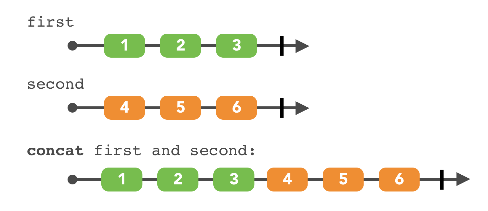

# 9장 Combining Operators

이전 장에서 옵저버블 시퀀스를 어떻게 만들고 filter하고 transform하는지 배웠다. RxSwift의 filtering과 transforming 연산자는 스위프트의 표준 라이브러리의 콜렉션 연산자처럼 동작한다. 또한 적은 코드로 많은 일을 가능케하는 flatMap을 통해 RxSwift의 진정한 힘을 맛봤다.

&nbsp;

이번 장은 시퀀스를 모으는 몇가지 다른 방법과 각 시퀀스의 데이터를 어떻게 합치는지를 보여줄 것임. 몇가지 연산자는 마찬가지로 스위프트 콜렉션 연산자와 비슷하게 동작할 것임. 이 연산자는 배열과 마찬가지로 비동기 시퀀스의 요소를 결합하는데 도움을 준다.

&nbsp;

[TOC]

&nbsp;

## 1. Prefixing and concatenating

옵저버블을 사용할 때 가장 먼저 필요한건 옵저버가 초기 값을 받도록 보장하는 것임. "현재 상태"가 먼저 필요한 상황이 있다. 좋은 용례는 "현재 위치"와 "네트워크 연결 상태" 이다. 이런 것들은 현재 상태를 접두사로 붙이고 싶은 옵저버블이다.

&nbsp;

### startWith

아래 다이어그램은 startWith 연산자가 하는 일을 잘 나타냄


코드로 표현하면 다음과 같다

```swift
  let numbers = Observable.of(2, 3, 4)

  let observable = numbers.startWith(1)
  _ = observable.subscribe(onNext: { value in
    print(value)
  })
/* print
1
2
3
4 */
```

startWith 연산자는 주어진 초기 값을 옵저버블 시퀀스 앞에 붙인다. 초기 값은 옵저버블의 요소와 같은 타입이어야 함

numbers 옵저버블 뒤에 연결했기 때문에 순서는 뒤이지만 맨 앞 초기 값으로 방출되는것에 주의

&nbsp;

startWith 연산자는 많은 상황에서 쓰게 될 것임. RxSwift의 결정론적인 특성과 잘맞고 옵저버들이 초기값을 즉시 받은 이후 업데이트를 받는것을 보장한다.

stratWith는 더 일반적인 concat 연산자 계열의 간단한 변형이다. 초기 값은 한 개 요소의 시퀀스인데, RxSwift는 startWith 연결로 그 시퀀스에 다른 시퀀스를 추가한다. concat 정적 함수는 두 시퀀스를 연결한다.

&nbsp;

### concat

concat 연산자의 다이어그램과 코드를 보자



```swift
 let first = Observable.of(1, 2, 3)
 let second = Observable.of(4, 5, 6)

 let observable = Observable.concat([first, second])

 observable.subscribe(onNext: { value in
    print(value)
 })
```

startWith를 사용할 때 보다 연결 순서가 더 명확하다. 123 다음 456을 볼 수 있다.

&nbsp;

Observable.concat(_:) 정적 메소드는 옵저버블의 정렬된 콜렉션(배열) 혹은 옵저버블의 다양한 리스트를 취한다. 콜렉션의 첫번째 시퀀스를 구독하고 요소가 complete될때까지 전달한다음 다음 시퀀스로 넘어간다. 과정은 콜렉션안의 모든 옵저버블이 사용될 때 까지 반복된다. 만약 옵저버블의 어느 지점에서 에러가 방출되면, 연결된 옵저버블은 차례로 에러를 방출하고 종료된다.

&nbsp;

시퀀스를 추가하는 또 다른 방법은 concat 연산자이다(클래스 메소드가 아닌 Observable의 인스턴스 메소드임). 다음 코드를 보자.

```swift
  let germanCities = Observable.of("Berlin", "Münich", "Frankfurt")
  let spanishCities = Observable.of("Madrid", "Barcelona", "Valencia")

  let observable = germanCities.concat(spanishCities)
  _ = observable.subscribe(onNext: { value in
    print(value)
  })
/* print
Berlin
Münich
Frankfurt
Madrid
Barcelona
Valencia
*/
```

이런 변형은 기존의 옵저버블에 적용한다. 소스 옵저버블이 complete될 때까지 기다린 후, 매개 변수 옵저버블을 구독한다. 인스턴스화를 제외하곤 Observable.concat(클래스 메소드)처럼 동작한다. 콘솔을 보면 독일 도시 목록과 뒤따르는 스페인 도시 목록을 확인 할 수 있을 것임

옵저버블 시퀀스는 매우 형식적이다. 그래서 타입이 같은 요소의 시퀀스만을 연결 지을 수 있다!

다른 타입의 시퀀스를 연결지으려고하면 컴파일러 에러가 날 것임. 스위프트 컴파일러는 시퀀스 타입을 알기 때문에 Observable<String>과 Observable<Int>를 섞는걸 허용하지 않을것임

&nbsp;

### concatMap

마지막으로 concatMap 연산자는 7장에서 배운 flatMap과 밀접한 연관이 있다. concatMap에 전달한 클로저는 연산자가 먼저 구독한 옵저버블 시퀀스를 리턴한다. 그런다음 방출하는 값을 결과 시퀀스로 전달한다. concatMap(_:)은 클로저가 생성하는 각 시퀀스가 다음 옵저버블 시퀀스를 구독하기 전에 완료됨을 보장한다. flatMap의 힘과 함께 순차적인 순서를 보장하는 편리한 방법이다(concat + flatMap인듯?). 아래 코드를 보자.

```swift
  /// 1...
  let sequences = [
    "German cities": Observable.of("Berlin", "Münich", "Frankfurt"),
    "Spanish cities": Observable.of("Madrid", "Barcelona", "Valencia")
  ]

  /// 2...
  let observable = Observable.of("German cities", "Spanish cities")
    .concatMap { country in sequences[country] ?? .empty() }

  /// 3...
  _ = observable.subscribe(onNext: { string in
      print(string)
    })
/* print
Berlin
Münich
Frankfurt
Madrid
Barcelona
Valencia
*/
```

/// 1... 독일과 스페인의 도시 이름을 생성하는 두 개의 시퀀스 준비

/// 2... 나라 이름을 방출하는 시퀀스가 있고 차례로 이 나라의 도시 이름을 방출하는 시퀀스에 매핑

/// 3... 다음 국가 시작을 고려하기 전 먼저 독일의 모든 시퀀스를 방출 한다.

이제 시퀀스를 어떻게 함께 추가하는지 알았으니 여러 시퀀스로부터 요소들을 결합하는것을 알아보자.

&nbsp;

&nbsp;

## 2. Merging

### merge

RxSwift는 시퀀스를 결합하는 몇가지 방법을 제공한다. 그 중 merge 연산자가 가장 쉽다. 아래 다이어그램이 어떻게 동작할지 예상해보자.


위 다이어그램을 코드로 구현해보자.

```swift
/// 1... 
let left = PublishSubject<String>()
let right = PublishSubject<String>()
/// 2...
let source = Observable.of(left.asObservable(), right.asObservable())
let observable = source.merge()
  _ = observable.subscribe(onNext: { value in
    print(value)
})
/// 3...
  var leftValues = ["Berlin", "Munich", "Frankfurt"]
  var rightValues = ["Madrid", "Barcelona", "Valencia"]
  repeat {
      switch Bool.random() {
      case true where !leftValues.isEmpty:
          left.onNext("Left:  " + leftValues.removeFirst())
      case false where !rightValues.isEmpty:
          right.onNext("Right: " + rightValues.removeFirst())
      default:
          break
      }
  } while !leftValues.isEmpty || !rightValues.isEmpty
/// 4...
left.onCompleted()
right.onCompleted()
/* print
Right: Madrid
Left:  Berlin
Right: Barcelona
Right: Valencia
Left:  Munich
Left:  Frankfürt
*/
```

/// 1... 값을 푸시할 수 있는 서브젝트를 두 개 준비하자.

/// 2... 두 서브젝트로부터 병합 옵저버블을 생성하고 방출하는 값을 프린트할 구독 또한 생성하자.

/// 3... 그런 다음 각 옵저버블에 무작위로 값을 뽑아서 넣어보자. 반복문은 leftValues와 rightValues 배열의 모든 값을 사용한다.

/// 4... 마지막으로 left와 right 서브젝트에 onCompleted를 호출하자.

&nbsp;

merge() 옵저버블은 전달 받은 각 시퀀스를 구독하고 요소들을 받자마자 방출한다. 미리 정해진 순서는 없다.

left와 right 시퀀스를 구독하고있다가 left와 right를 통해 받은 요소들을 바로 방출한다는 의미

&nbsp;

merge()가 언제 완료되는지 궁금할 것임. RxSwift에서 모든것이 그런것 처럼, 규칙이 정해져있다.

* merge()는 소스 시퀀스와 모든 내부 시퀀스가 완료된 이후에 완료된다.
* 내부 시퀀스가 완료되는 순서는 관련이 없다.
* 만약 어떤 시퀀스라도 에러를 방출하면, merge() 옵저버블은 즉시 에러를 전달하고 종료된다.

코드를 잠깐 다시보면 merge()가 스스로 element type의 옵저버블 시퀀를 방출하는 소스 시퀀스를 취하는 것을 알아차릴 것임 (소스 시퀀스는 자체적으로 <String>타입 요소를 방출하는 left와 right 시퀀스를 취하고 있음)

즉 merge()가 구독하도록 수많은 시퀀스를 보낼 수 있다는 뜻.

&nbsp;

### merge(maxConcurrent: )

한 번에 구독할 수 있는 시퀀스의 수를 제한하기 위해, merge(maxConcurrent:)를 사용 할 수 있다. 이 변형은 최대 제한 수에 도달 할 때 까지 들어오는 시퀀스를 계속 구독한다. 제한에 도달 후엔 들어오는 옵저버블을 큐에 넣는다. 활성 중인 시퀀스가 완료되자마자 차례로 큐에 있는 옵저버블을 구독할 것임.

최대 제한에 도달된 뒤 들어온 옵저버블이 없어지는게 아니라 대기열 큐에 들어가는구나?

&nbsp;

결국 이 제한 변형은 merge()보다 사용할 일이 적을것임. 그럼에도 리소스가 제한된 상황에서 유용하다는 것을 명심하자. 네트워크 요청할 때 동시에 나가는 연결 수를 제한하고자 하는 상황에서 쓸 수 있을것임.

&nbsp;

&nbsp;

## 3. Combining elements

### combineLatest

RxSwift에서 필수적인 연산자 그룹은 combineLatest다. 몇개의 시퀀스로부터 값들을 결합한다.


내부에 (결합된) 시퀀스가 값을 방출할 때 마다, 같이 제공된 클로저를 호출한다. 내부의 각각 시퀀스가 방출한 마지막 값을 받는다. 많은 구체적인 앱들이 있는데, 한 번에 여러 텍스트 필드를 관찰하고 필드들의 값을 결합하는것, 여러 소스의 상태를 보는 것들이 있다.

다시 말해 내부의 시퀀스 들 중 하나라도 이벤트를 방출하면 결합된 모든 시퀀스들의 마지막 방출 값들을 받게 된다.

꽤 간단하다. 코드 예시로 확인해보자.

```swift
	let left = PublishSubject<String>()
	let right = PublishSubject<String>()

  let observable = Observable.combineLatest(left, right) {
    lastLeft, lastRight in
    "\(lastLeft) \(lastRight)"
  }

  _ = observable.subscribe(onNext: { value in
    print(value)
  })

print("> Sending a value to Left")
left.onNext("Hello,")
print("> Sending a value to Right")
right.onNext("world")
print("> Sending another value to Right")
right.onNext("RxSwift")
print("> Sending another value to Left")
left.onNext("Have a good day,")

left.onCompleted()
right.onCompleted()

/* print
> Sending a value to Left
> Sending a value to Right
Hello, world
> Sending another value to Right
Hello, RxSwift
> Sending another value to Left
Have a good day, RxSwift
*/
```

1. 각 시퀀스의 최신 값들을 인자로 받는 클로저를 이용해서 옵저버블들을 결합했다. 위 에에서, 결합은 left 값과 right 값의 연결된 문자열이다. 결합된 옵저버블이 방출하는 값의 타입이 클로저의 리턴 타입이기 때문에 어떤 것이든 될 수 있다. 실제로, 이건 다른 타입의 결합이 가능함을 의미한다. combineLatest는 그걸 가능케 하는 흔치 않은 핵심 연산자 중 하나다. 다른 하나 withLatestFrom(_:)은 잠시 후 알아보자.
2. 각각의 옵저버블이 하나씩의 값을 방출하기 전에는 아무 일도 일어나지 않는다. 각각 하나씩의 값을 방출한 다음엔, 새로운 값을 방출할 때마다 클로저는 각 옵저버블의 최신 값을 받아서 새로운 결과를 생성해낸다.

&nbsp;

combineLatest()는 클로저를 호출하기 전까지 모든 옵저버블이 하나의 요소를 방출하길 기다린다는 것을 기억하자. 자주 혼동하는 원인이기도 하고 즉시 값을 제공하지 않는 시퀀스에 초기값을 제공하기 위해 startWith 연산자를 사용 할 수 있는 좋은 기회이다.

&nbsp;

7장 Transforming Operators에서 다룬 map 연산자와 같이 combineLatest 연산자는 클로저가 리턴하는 타입의 옵저버블을 생성한다. 이건 일련의 연산자 체인과 함께 새로운 타입으로 전환 할 수 있는 훌륭한 기회임. (map과 비슷하지만 여러 시퀀스의 최신값을 결합 할 수 있는 기능이 추가됐네)

&nbsp;

흔한 패턴은 값을 튜플로 결합해서 다음 체인으로 전달하는것임. 예를 들면 아래 코드처럼 값을 결합해서 filter를 호출해서 작업을 할 수 있다.

```swift
let observable = Observable
  .combineLatest(left, right) { ($0, $1) }
  .filter { !$0.0.isEmpty }
```

combineLatest 연산자 그룹에 몇 가지 변형이 있다. 변형들은 2~8개의 옵저버블 시퀀스를 매개변수로 취한다. 위에서 언급한대로, 시퀀스들은 같은 타입의 요소를 가질 필요가 없다.

다른 예시를 보자.

```swift
  let choice: Observable<DateFormatter.Style> = Observable.of(.short, .long)
  let dates = Observable.of(Date())

  let observable = Observable.combineLatest(choice, dates) {
    format, when -> String in
    let formatter = DateFormatter()
    formatter.dateStyle = format
    return formatter.string(from: when)
  }

  _ = observable.subscribe(onNext: { value in
    print(value)
  })
```

위 예시는 유저가 세팅을 바꿀때 화면의 값이 자동으로 업데이트되는 시연이다. 위 패턴으로 모든 수동 업데이트를 삭제할 수 있음을 생각해보자.

날짜 포맷 형식을 바꾸면 바꾼 설정과 최신 날짜 데이터가 결합되어 화면에 반영될것임 반대로 시간을 변경해도 최신 포맷 형식과 결합되어 반영된다.

&nbsp;

combineLatest의 마지막 변형은 옵저버블의 콜렉션과 배열의 최신 값을 수신하는 결합 클로저를 취한다. 콜렉션을 취하기 때문에, 모든 옵저버블은 같은 타입의 요소를 갖는다.

&nbsp;

다중 매개변수 변형보다는 덜 유연하기 때문에, 잘 쓰이지 않지만 이전의 String 옵저버블 예를 다음과 바꿀 수 있기 때문에 알아두면 유용하다.

```swift
/// before
let observable = Observable.combineLatest(left, right) {
    lastLeft, lastRight in
    "\(lastLeft) \(lastRight)"
  }
/// after
let observable = Observable.combineLatest([left, right]) {
    strings in strings.joined(separator: " ")
  }
```

마지막으로 중요한 것은, combineLatest는 내부 시퀀스의 마지막 시퀀스가 complete됐을 때만 complete된다. 그 전에는, 계속 결합된 값들을 보낸다. 만약 어떤 시퀀스가 종료되면, 다른 시퀀스에서 방출된 새로운 값과 결합하기 위해 마지막으로 방출된 값을 사용한다.

&nbsp;

또 다른 결합 연산자는 zip 연산자이다. combineLatest와 비슷하게 여러 변형이 있다. 다이어그램과 코드를 보자.

### zip


```swift
  /// 1...
	enum Weather {
    case cloudy
    case sunny
  }
  let left: Observable<Weather> = Observable.of(.sunny, .cloudy, .cloudy, .sunny)
  let right = Observable.of("Lisbon", "Copenhagen", "London", "Madrid", "Vienna")
	/// 2...
	  let observable = Observable.zip(left, right) { weather, city in
    return "It's \(weather) in \(city)"
  }
  _ = observable.subscribe(onNext: { value in
    print(value)
  })
/* print
It's sunny in Lisbon
It's cloudy in Copenhagen
It's cloudy in London
It's sunny in Madrid
*/
```

/// 1... Weather enum과 두 개의 옵저버블 생성

/// 2... left와 right 옵저버블을 zip연산자로 결합한 옵저버블 생성. zip(_:_"resultSelector:) 변형을 쓰고 있음을 인지하자. 가독성을 높히기 위해 마지막 괄호 뒤에 클로저를 둔 축약형을 사용하자.

zip이 하는 일은 아래와 같다.

* 제공 받은 소스 옵저버블들을 구독한다.
* 각각의 옵저버블이 새로운 값을 방출하길 기다린다.
* 양쪽의 새로운 값과 함께 클로저를 호출한다.

Vienna가 print되지 않은 이유를 알아차렸는가?

&nbsp;

zip연산자는 각 옵저버블의 각각의 새 값을 동일한 논리적 위치서(첫 번째 값 끼리, 두 번째 값 끼리) 짝짓는다. 만약 하나의 내부 옵저버블로부터 다음 논리적 위치에서 사용가능한 다음 값이 없으면(위 예시에서 보듯이 5번째 위치에서 쓸 left의 새로운 값이 없음), zip 연산자는 더이상 방출하지 않을것임.

인덱스 시퀀싱이라고 불리는데, 잠금단계?에서 시퀀스를 걷는? 방법이다(두 값을 모두 받을 때까지 멈춰있으니 잠금이라는 표현을 사용한 것 같다. 시퀀스륽 걷는다는건 흘러감을 얘기하는듯?). 그러나 zip연산자는 방출을 일찍 멈출수 있지만, 내부의 옵저버블들이 모두 완료될때까지 자체적으로 완료되지 않으므로 내부 옵저버블들이 작업을 완료할 수 있는지 확인한다.

&nbsp;

Swift 또한 zip 콜렉션 연산자가 있다. 양쪽 콜렉션으로부터 요소로 튜플로 구성된 새로운 콜렉션을 생성한다(역시 짧은 콜렉션에 맞춰서 생성된다). Swift는 이게 유일한 구현이지만 RxSwift는 2개~8개의 옵저버블을 위한 변형과 combineLatest처럼 콜렉션을 위한 변형을 제공한다.

&nbsp;

&nbsp;

## 4. Triggers

앱은 다양한 요구사항이 있고 다양한 인풋 소스를 다뤄야 한다.  종종 몇몇 옵저버블로부터 인풋을 한번에 받을 필요가 있을 것임. 코드에서 어떤건 단순히 액션을 트리거하고 반면 다른건 데이터를 제공한다. RxSwift는 삶을 편하게 해줄 강력한 연산자를 제공한다. 적어도 코딩 삶은~

&nbsp;

### withLatestFrom

먼저 withLatestFrom을 살펴보자. 비기너들이 종종 간과하는데, withLatestFrom은 무엇보다 유저 인터페이스를 다룰 때 유용한 도구이다.


위 다이어그램에서 보듯이 동작을 트리거하는 button과 데이터를 제공하는 textfield가 함께 사용된다. 코드로 보자.

```swift
	/// 1...  
	let button = PublishSubject<Void>()
  let textField = PublishSubject<String>()

	/// 2...
  let observable = button.withLatestFrom(textField)
  _ = observable.subscribe(onNext: { value in
    print(value)
  })

  textField.onNext("Par")
  textField.onNext("Pari")
  textField.onNext("Paris")
  button.onNext(())
  button.onNext(())
/* print
Paris
Paris
*/
```

위 예시 코드는 실제 text field와 button을 시뮬레이션한다. 추후 UI와 RxSwift의 결합을 도와주는 프레임워크인 RxCocoa에 대해 배울것임. 

&nbsp;

/// 1... button 탭과 text field 인풋을 시뮬레이팅 하기 위해 두 개의 subject 생성. button은 실제 데이터를 전달하지 않기 때문에, 요소의 타입으로 Void를 사용할 수 있다.

/// 2... button이 값을 방출했을 때, 그걸 무시하고 대신 시뮬레이션 text field에서 받은 최신 값을 방출한다.

/// 3... 텍스트 필드에 대한 연속 입력을 시뮬레이션한다. 입력은 두 번의 연속 버튼 탭으로 완료된다.

&nbsp;

간단하고 직관적이다! withLatestFrom(_:)은 오직 특정한 트리거가 발생했을 때 옵저버블에서 방출된 현재(최신) 값을 원하는 모든 상황에 유용하다.

withLatestFrom의 가까운 친척은 sample이다.


단지 하나의 변형으로 거의 같은 작업을 한다: 트리거 옵저버블이 값을 방출 할 때마다, sample(_:)은 다른 옵저버블의 최신 값을 방출한다. 그러나 마지막 트리거 이후에 도착한 경우에만. 만약 도착한 새 데이터가 없으면, sample은 아무것도 방출하지 않는다.

```swift
/// 1...  
	let button = PublishSubject<Void>()
  let textField = PublishSubject<String>()

	/// 2...
  let observable = button.sample(textField)
  _ = observable.subscribe(onNext: { value in
    print(value)
  })

  textField.onNext("Par")
  textField.onNext("Pari")
  textField.onNext("Paris")
  button.onNext(())
  button.onNext(())
/* print
Paris
*/
```

위 코드에서는 Paris가 한 번 출력됬다! 왜냐면 text field가 button 탭 사이에 새로운 값을 방출하지 않았기 때문. 물론 withLatestFrom 옵저버블에 distinctUntilChanged()를 추가해서 동일한 작업을 할 수 있지만, 가능한 적은 연산자 체인은 Rx의 정신이다.

&nbsp;

주의: withLatestFrom은 데이터 옵저버블을 매개변수로 취하는 반면, sample은 트리거 옵저버블을 매개변수로 취한다는것을 기억하자. 실수의 원인이 된다.

&nbsp;

트리거를 기다리는건 UI작업할 때 훌륭한 도움이 된다. 트리거가 관찰가능한 시퀀스의 형태로 오는 경우나 한쌍의 옵저버블을 기다리면서 하나는 보관하고 싶을 때. RxSwift가 연산자를 제공한다.

&nbsp;

&nbsp;

## 5. Switches

RxSwift는 두 가지 주요 switching 연산자라 불리는 amp(_:)와 switchLatest() 가 있다. 둘 다 결합된 혹은 소스 시퀀스의 이벤트 사이에 전환함으로써 옵저버블 시퀀스를 생성하도록 한다. 어떤 시퀀스의 이벤트가 구독자에게 전달될지 런타임에 결정하도록 한다. 

먼저 amb연산자의 다이어그램과 코드를 보자.


```swift
	let left = PublishSubject<String>()
  let right = PublishSubject<String>()

  let observable = left.amb(right)
  _ = observable.subscribe(onNext: { value in
    print(value)
  })

  left.onNext("Lisbon")
  right.onNext("Copenhagen")
  left.onNext("London")
  left.onNext("Madrid")
  right.onNext("Vienna")

  left.onCompleted()
  right.onCompleted()
/* print
Lisbon
London
Madrid
*/
```

left subject만 출력된 것을 볼 수 있다. 

amb 연산자는 left와 right 옵저버블을 구독한다. 그 중 하나라도 요소를 방출하길 기다리다가 방출되면 다른 하나는 구독을 취소한다. 이후, 처음 활성화된 옵저버블의 요소만을 전달한다. Amb(ambiguous)라는 용어대로 작동한다: 어떤 시퀀스에 관심이 있는지 모르지만 하나가 이벤트를 발행할 때 결정하고 싶다.

&nbsp;

이 연산자는 종종 간과된다. 많은 서버에 연결하고 처음 응답한 서버에 고수하는것 과 같은 실용적인 어플리케이션에 선택지가 된다.

더 인기 있는 선택지는 switchLatest() 연산자이다.

### switchLatest


```swift
  /// 1...
	let one = PublishSubject<String>()
  let two = PublishSubject<String>()
  let three = PublishSubject<String>()

  let source = PublishSubject<Observable<String>>()
	
	/// 2...
  let observable = source.switchLatest()
  let disposable = observable.subscribe(onNext: { value in
    print(value)
  })

	/// 3...
  source.onNext(one)
  one.onNext("Some text from sequence one")
  two.onNext("Some text from sequence two")

  source.onNext(two)
  two.onNext("More text from sequence two")
  one.onNext("and also from sequence one")

  source.onNext(three)
  two.onNext("Why don't you see me?")
  one.onNext("I'm alone, help me")
  three.onNext("Hey it's three. I win.")

  source.onNext(one)
  one.onNext("Nope. It's me, one!")

  disposable.dispose()
/* print
Some text from sequence one
More text from sequence two
Hey it's three. I win.
Nope. It's me, one!
*/
```

/// 1... 세 개의 서브젝트와 소스 서브젝트를 생성하고. 옵저버블 시퀀스를 이 시퀀스에 푸시할 것임

/// 2... switchLatest() 연산자로 옵저버블을 생성하고 결과를 프린트한다.

/// 3... 소스에 옵저버블을 제공하고 옵저버블에 값을 제공한다.

주의 : 옵저버블들의 옵저버블을 머릿속에 모델링하는게 어려울것임. 걱정말라, 익숙해질 것임. 연습은 시퀀스를 유동적으로 이해하는데 중요함. 경험이 성장함에 따라 예시를 검토하는데 주저말라! 다음 장에서 잘 활용하는 방법에 대해 배울것임

&nbsp;

프린트된 아웃풋을 보자. 소스 옵저버블에 추시된 최신 시퀀스로부터의 아이템만 프린트 되었다. 이게 바로 switchLatest가 의도한 동작이다.

&nbsp;

주의: switchLatest()와 다른 연산자의 유사성을 알아차렸는가? Transforming Operators 장에서 사촌격인 flatMapLatest(_:)에 대해 배웠었다. 둘은 꽤 비슷한 동작을 한다. flatMapLatest는 최신 값을 옵저버블에 매핑하고 그걸 구독한다. switchLatest와 마찬가지로 오직 최신 구독만 활성 상태로 유지한다.

&nbsp;

&nbsp;

## 6. Combining elements within a sequence

### reduce

모든 요리사는 졸일수록 소스가 맛있어 진다는것을 안다. 비록 쉐프를 겨냥한 것은 아니지만, RxSwift는 소스를 가장 맛있는 구성요소로 졸일 도구가 있다.

비록 Swift 세계에서 이미 reduce() 콜렉션 연산자에 대해 알겠지만. 그렇지 않다면 기회가 있다. 이 지식은 Swfit 콜렉션에도 적용이 된다.

타이틀 '시퀀스안에서 요소들을 합치기' 처럼 reduce를 이용해서 시퀀스를 순회하며 특정 연산을 시행하는 것 같다. 그럼 시퀀스의 개수가 정해져있어야 하지 않을까? -> 소스 옵저버블이 완료될때까지 기다리는군


```swift
  let source = Observable.of(1, 3, 5, 7, 9)

  let observable = source.reduce(0, accumulator: +)
  _ = observable.subscribe(onNext: { value in
    print(value)
  })
```

Swift 콜렉션에서 하는것과 거의 같지만 옵저버블 시퀀스인게 다르다. 위 코드에서는 값들을 더하기 위해 shortcut(+연산자)를 이용했다. 코드 자체로는 설명이 부족하다. 어떻게 동작하는지 알기위해, observable 생성을 아래 코드로 대체하자.

```swift
  let observable = source.reduce(0) { summary, newValue in
    return summary + newValue
  }
```

연산자는 요약 값을 "누적"한다. 제공받은 초기값(위 예에서는 0)으로 시작한다. 소스 옵저버블이 아이템을 방출할 때마다, reduce는 새 요약을 생성하기위해 클로저를 호출한다. 소스 옵저버블이 완료되면, reduce는 요약값을 방출한 다음 완료된다.

주의: reduce는 소스 옵저버블이 완료됐을때 (누적된) 요약값을 생성한다. 절대 끝나지 않는 시퀀스에 이 연산자를 적용하면 아무것도 방출되지 않는다. 숨은 문제와 혼동의 주된 원인이므로 주의하자.

&nbsp;

### scan

reduce( _: _:)의 가까운 친적은 scan( _: accumulateor: ) 연산자다. 아래 다이어그램과 reduce 다이어그램의 차이점을 발견해보자.


```swift
  let source = Observable.of(1, 3, 5, 7, 9)

  let observable = source.scan(0, accumulator: +)
  _ = observable.subscribe(onNext: { value in
    print(value)
  })
/* print
1
4
9
16
25
*/
```

인풋 밸류마다 아웃풋을 얻는다. 예상한대로, 이 값은 클로저에의해 누적된 값이다.

소스 옵저버블이 요소를 방출할 때마다, scan은 클로저를 호출한다. 새 요소와 함께 실행된 값을 전달하고, 클로저는 새 누적된 값을 반환한다.

reduce처럼 결과 옵저버블 타입은 클로저의 반환 타입이다.

scan의 사용 범위는 꽤 넓다. scan은 누계, 통계, 상태 등을 계산하는데 사용 될 수 있다.

scan 옵저버블에 상태 정보를 캡슐화하는 것은 좋은 생각이다. 지역 변수를 사용할 필요가 없고 소스 옵저버블이 완료되면 사라진다. RxGesture장에서 scan의 괜찮은 예시를 몇개 볼 수 있을것임


