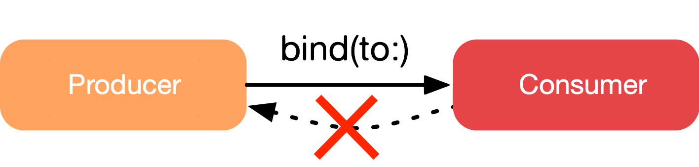
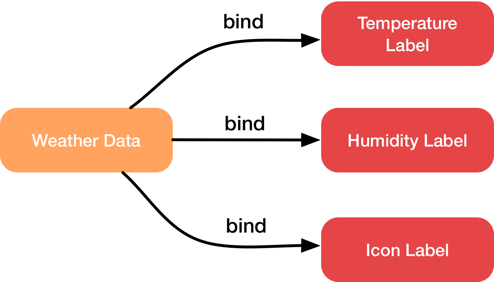
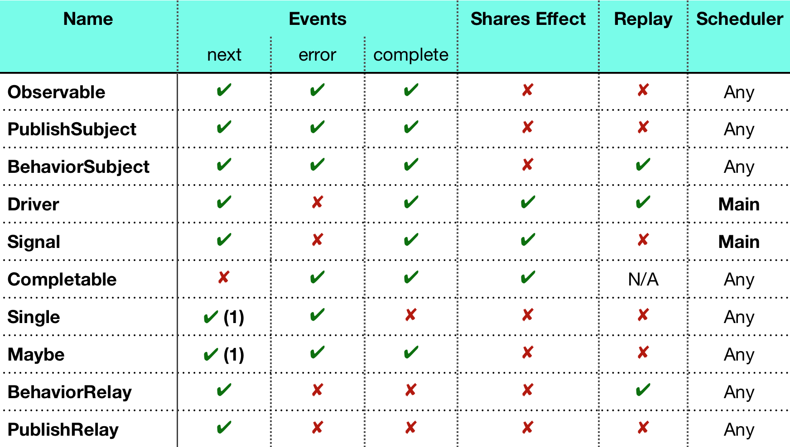

#12장 Beginning RxCocoa

이전 장에서 RxSwift의 기능적인 부분과 어떻게 생성하는지, 옵저버블을 구독하고 폐기하는것에 대한 기초를 소개했음. 앱에서 RxSwift를 적절하게 사용하고 예기치 못한 부작용과 원하지 않는 결과를 피하기 위해서 이 주제들을 이해하는게 중요함.

&nbsp;

지금부터는 옵저버블을 어떻게 생성하고, 구독하고 어떻게 폐기가 동작하는지 이해하고 RxSwift가 제공하는 가장 중요한 연산자에 대해 아는게 중요하다.

&nbsp;

이번 장에서는 RxSwift 레포지토리의 일부인 또다른 프레임워크 RxCocoa를 소개하겠음

&nbsp;

RxCocoa는 모든 플랫폼에서 작동하고 iOS, watchOS, iPadOS, tvOS, macOS... 요구 사항을 대상으로 한다. 각 플랫폼은 커스텀 래퍼를 갖고 많은 UI 컨트롤과 SDK 클래스에 일련의 내장된 확장을 제공한다. 이번 장에서는 iOS를 위해 제공된 것들을 사용 할 것임.

&nbsp;

시작하기 앞서 Pods 프로젝트에 RxCocoa 설치로 추가된 UITextFiled+Rx.swift 파일을 열어보자. ControlProperty<String?> 타입이고 이름이 text 프로퍼티를 확인 할 수 있다.

&nbsp;

ControlProperty는 값이 관찰될 수(읽기) 있고 새로운 값을 방출할 수(쓰기)도 있는 특별한 Subject다. 프로퍼티의 이름은 무엇이 관찰될 지 잘 나타낸다. text는 프로퍼티가 UITextField 안의 text와 직접적으로 연관이 있음을 의미한다.

&nbsp;

이번엔 UILabel+Rx.swift 파일을 열어보자. text와 attributedText 두 개의 새로운 프로퍼티가 있다. 두 개 모두 UILabel의 프로퍼티와 연관이 있기 때문에 이름이 혼동되지 않고 목적도 명확하다. 두 프로퍼티에서 사용되는 Binder라는 새로운 타입이 있다.

&nbsp;

Binder는 새로운 값을 방출할 수(쓰기) 있지만 값이 관찰될 수 없는 무언가를 나타내기 유용한 구조체이다. 값을 특정 구현이나 기본 객체에 묶을때 종종 사용된다. ControlProperty는 관찰될 수 있지만 Binder는 불가능하다는 점이 다르다. ControlEvent는 Binder와 반대로 값이 관찰될 수는 없지만 새로운 값을 방출 할 수 없다.

&nbsp;

Binder에 대한 두 가지 재밌는 사실은 에러를 방출 할 수 없다는것과 base 오브젝트의 약한 참조 유지 또한 처리한다는 것임. 그래서 성가신 메모리 누수나 약한 참조를 처리할 필요가 없다. Binder의 구현 코드를 보면 약한 참조처리와 next 이벤트일때만 작동하도록 처리가 되어있음.

&nbsp;

[TOC]

&nbsp;

## 1. Using RxCocoa with basic UIKit controls
###Displaying the data using RxCocoa
RxCocoa는 Cocoa를 기반으로 많은 것을 추가했기 때문에 이 기능을 사용해서 궁극적인 목표를 달성할 수 있다. RxCocoa는 프로토콜 확장의 힘을 사용해서 많은 UIKit의 요소들에 rx 네임스페이스를 추가했다. 예를 들어 UITextField.rx.text 프로퍼티는 ControlProperty<String?> 옵저버블을 반환한다. 이 옵저버블은 ObservableType과 ObserverType 모두를 따르기 때문에 구독할 수도 있고 새 값을 추가해서 text 필드를 설정할 수 있다.

```swift
        searchCityName.rx.text.orEmpty /// .orEmpty는 nil값이 방출됐을 때 빈 문자열을 방출하도록 함 .map { $0 ?? ""}과 동일
            .filter { !$0.isEmpty }
            .flatMap { text in
                ApiController.shared
                    .currentWeather(for: text)
                    .catchErrorJustReturn(.empty) /// API에서 에러가 발생했을 때 옵저버블이 폐기 되는것을 막아줌
            }
            .observeOn(MainScheduler.instance) /// UI작업을 하기 위해 컨텍스트를 메인스레드로 지정
            .subscribe(onNext: { [weak self] data in
                self?.tempLabel.text = "\(data.temperature)° C"
                self?.iconLabel.text = data.icon
                self?.humidityLabel.text = "\(data.humidity)%"
                self?.cityNameLabel.text = data.cityName
            })
            .disposed(by: disposeBag)
```

&nbsp;

###Retrieving data from the OpenWeather API
```swift
    let url = baseURL.appendingPathComponent(pathComponent)
    var request = URLRequest(url: url)
    let keyQueryItem = URLQueryItem(name: "appid", value: apiKey)
    let unitsQueryItem = URLQueryItem(name: "units", value: "metric")
    let urlComponents = NSURLComponents(url: url, resolvingAgainstBaseURL: true)!

    if method == "GET" {
      var queryItems = params.map { URLQueryItem(name: $0.0, value: $0.1) }
      queryItems.append(keyQueryItem)
      queryItems.append(unitsQueryItem)
      urlComponents.queryItems = queryItems
    } else {
      urlComponents.queryItems = [keyQueryItem, unitsQueryItem]

      let jsonData = try! JSONSerialization.data(withJSONObject: params, options: .prettyPrinted)
      request.httpBody = jsonData
    }

    request.url = urlComponents.url!
    request.httpMethod = method

    request.setValue("application/json", forHTTPHeaderField: "Content-Type")

    let session = URLSession.shared
		return session.rx.data(request: request) /// 1...
```

/// 1...  URLSession을 위한 rx 확장인 data 메소드는 URL 요청에 대한 응답 데이터의 관찰 가능한 시퀀스를 리턴한다. URL 요청은 메소드를 호출할 때가 아니라 관찰자가 등록 된 후에 시작 됨. request 중 에러가 발생하면 시퀀스는 에러와 함께 종료된다. 응답 상태 코드가 200..<300이 아니면 시퀀스는 또한 에러와 함께 종료된다. 에러가 발생했을 때나 에러 상태 코드에 대한 처리를 해줘서 유용한듯

** URL 요청이 관찰자 별로 수행되는것에 주의(동일한 응답값을 사용할때는 share연산자 같은걸 써줘야 할듯 그럼 요청 한번만 하면 되겠다.)

&nbsp;

&nbsp;

##2. Binding observables

binding은 다소 논란이 있다. 예를 들면 애플은 macOS에서 오랫동안 중요한 부분이 되어왔던 코코아 바인딩 시스템을 iOS에는 출시하지 않는다. Mac 바인딩은 매우 진보했고 macOS SDK의 특정 애플 제공 클래스와 긴밀히 결합되어있다. 왜 iOS에는 바인딩시스템을 안만들었을까? 바인딩이 데이터 모델과 UI 요소를 연결 짓는거라면 swiftUI와 combine이 보완책이 되지 않을까?

&nbsp;

RxCocoa는 프레임워크에 포함된 몇 가지 타입에만 의존하는 더 간단한 솔루션을 제공한다. 이미 RxSwift코드에 편안함을 느끼고 있기 때문에 바인딩을 빠르게 파악할 수 있을 것임

&nbsp;

RxCocoa에서 꼭 알아야하는 건 biding은 단방향 데이터 흐름이라는 것. 덕분에 앱에서의 데이터 흐름이 간소화 된다. 여기서는 양방향 바인딩은 다루지 않겠음

&nbsp;

### What are binding observables?

바인딩을 이해하는 가장 쉬운 방법은 관계를 두 엔티티 사이이의 연결로 생각하는 것


* 생산자는 값을 생산한다.
* 소비자는 생산자로부터의 값을 처리한다.

소비자는 값을 반환할 수 없다. 이것은 RxSwift에서 바인딩을 사용할 때 일반적인 규칙이다.



&nbsp;

주의: 단방향 데이터 흐름이 왜 간단하다는 걸까? 위 예시에서 양방향 데이터 흐름의 경우 4개의 요소 즉, 두 개의 생산자와 두 개의 소비자가 필요함. 코드가 상당히 복잡해질것임

&nbsp;

####bind(to:)

바인딩을 위한 기초적인 메소드는 옵저버블을 다른 엔티티에 연결하기 위해 쓰이는 bind(to:)이다. 소비자는 새 이벤트를 받아들일 수 있지만 구독(관찰)될 수 없는 쓰기 전용 엔티티인 ObserverType을 준수해야 한다.(ObserverType을 준수해야 옵저버블에서 받은 데이터를 새 이벤트로 쓸 수 있기 때문인듯?)

observerType - 관찰 할 수 있는 타입으로 새 이벤트를 받아들일 수 있다.

observableType - 관찰되어질 수 있는 타입으로 subscribe되어 이벤트를 수신 할 수 있다.

&nbsp;

RxSwift와 함께 제공되는 유일한 ObserverType은 Subject이다. subject는 새로운 이벤트를 쓸 수 있을뿐만 아니라 subject를 구독할 수 있도록 한다. 그게 가능한건 subject가 ObserverType이자 ObservableType이기 때문.

&nbsp;

subject는 Cocoa의 명령형 특성과 함께 작동하는데 매우 중요하다. UILabel, UITextField, UIImageView 같은 기초 컴포넌트들이 set되고 get될 수 있는 변하기 쉬운 데이터를 갖는걸 고려하면 말이다. 다시 말해서 UILabel의 값을 읽거나 쓰는 상황과 subject의 특성이 잘 들어맞는것 같다.

&nbsp;

주의: ObserverType 준수하는 객체 외에도 Relay에도 bind(to:)를 쓸 수 있다. 이 bind(to:) 메소드는 분리된 오버로드임, 왜냐면 Relay는 ObserverType을 준수하지 않기 때문에. 메소드 이름만 같을 뿐 따로 정의 되어 있다는 말인듯

relay는 오직 next이벤트만을 받아서 방출하는 subject의 래퍼이다. completed와 error는 추가할 수 없기 때문에 종료가 없는 시퀀스에 유용함.

&nbsp;

마지막으로, 흥미로운 사실은 bind(to:)가 subscribe()의 별명 혹은 syntactic sugar라는 것임. bind(to: observer) 호출은 내부적으로 subscribe(observer)일것임. Bind(to: observer)는 단순히 보다 의미잇고 직관적인 구문을 만들기 위해 제자리에 있다. 구독 보다는 연결이 더 직관적인가?

&nbsp;

###Using binding observables to display data

이제 바인딩이 뭔지 알았으니 앱에 통합 시킬 수 있다. 그 과정에서 전체 코드를 좀 더 우아하게 만들고 검색 결과를 재사용가능한 데이터 소스로 바꿀 수 있다.

&nbsp;

먼저 적용해야 할 변화는 subscribe(onNext:)로 알맞은 데이터를 UILabel에 할당하는 긴 옵저버블을 리팩토링하는 것임.
```swift
let search = searchCityName.rx.text.orEmpty
  .filter { !$0.isEmpty }
  .flatMapLatest { text in /// 1...
    ApiController.shared
      .currentWeather(for: text)
      .catchErrorJustReturn(.empty)
  }
  .share(replay: 1) /// 2...
  .observeOn(MainScheduler.instance)
```

/// 1... flatMap에서 flatMapLatest로 변경함으로써 새 네트워크 요청이 시작되면 이전 네트워크 요청을 취소시킨다. flatMap을 사용하면 이전에 진행중인 요청을 취소하는 것에 대한 처리가 없기 때문에 도시 이름을 타이핑 할 때마다 여러개의 결과를 받게 될것임

/// 2... 구독에 share(replay: 1)을 추가해서 스트림을 재사용가능하도록 만들고 일회용 데이터 소스를 다회용 옵저버블로 변환한다. share 연산자가 없으면 구독 개수 만큼 네트워크 요청이 발생한다😨

&nbsp;

두 번째 변경의 파워는 MVVM 관련 챕터에서 나중에 다룰것. 일단은 간단하게 다음과 같이 이해하자. Rx에서 observable은 매우 많이 재사용되어질 수 있는데 올바른 모델링은 길고, 읽기 어려운 일회용 옵저버를 다회용의 이해하기 쉬운 옵저버로 바꿀 수 있다.



두 개의 작은 변화로, 각각 다른 구독에서 모든 단일 매개 변수를 처리해서 표시하는데 필요한 값을 매핑 할 수 있다. 예를 들면 아래와 같이 공유된 데이터 소스 옵저버블에서 문자열 temerature이나 humidity등을 얻을 수 있다.

```swift
/// 리팩토링 전
.subscribe(onNext: { [weak self] data in
                self?.tempLabel.text = "\(data.temperature)° C"
                self?.iconLabel.text = data.icon
                self?.humidityLabel.text = "\(data.humidity)%"
                self?.cityNameLabel.text = data.cityName
            })
.disposed(by: disposeBag)

/// 리팩토링 후
search.map { "\($0.temperature)° C" }
	.bind(to: tempLabel.rx.text)
  .disposed(by: disposeBag)

search.map(\.icon)
  .bind(to: iconLabel.rx.text)
  .disposed(by: disposeBag)

search.map { "\($0.humidity)%" }
  .bind(to: humidityLabel.rx.text)
  .disposed(by: disposeBag)

search.map(\.cityName)
  .bind(to: cityNameLabel.rx.text)
  .disposed(by: disposeBag)

```

위 코드는 UI라벨에 표시하는데 필요한 문자열을 반환하는 observable을 생성한다.

또한 원본 데이터 소스를 각각 라벨에 바인딩하기 위해 bind(to:)를 사용한다.

&nbsp;

search라는 하나의 옵저버블 소스를 사용해서 서버에서 요청한 데이터를 표시하고 데이터의 다른 부분을 각 레이블에 바인딩한다.

리팩토링으로 이전에 subscribe(onNext:)에서 처리하는 것 보다는 코드의 양은 많아 졌지만 데이터의 사용처 마다 구독을 분리함으로써 가독성은 좋아진것 같다? 그리고 search라는 옵저버블을 재사용 가능하게 됐다?

&nbsp;

&nbsp;

## 3. Improving the code with Traits

RxCocoa는 Cocoa와 UIKit을 쉽게 사용 할 수 있도록 고급 기능을 제공한다. bind(to:)를 능가하는 observables의 특별한 구현체를 제공하는데 UI와 함께 사용되기 위해 독점적으로 만들어졌다. 바로 Traits이다. Traits은 ObserverType을 따르는 객체들의 집합인데 UI 작업할 때 직관적이고 쓰기 쉬운 코드를 만드는데 특화되어있다.

&nbsp;

주의: RxSwift의 traits과 마찬가지로, RxCocoa의 traits도 사용하기 쉬운 특수한 특성이지만 써도되고 안써도 된다. observable 쓰는걸 선호하는 사람이라면 이미 잘 알겠지만.

&nbsp;

###What are ControlProperty and Driver?

####ContolProperty and ControlEvent
####Driver
####Signal

traits의 정의는 다음과 같다.

특성은 인터페이스 경계를 넘어 관찰 가능한 시퀀스 속성을 전달하고 보장하는 데 도움이 된다.

헷깔리겠지만 RxCocoa의 traits을 사용하는 규칙은 전체 개념을 이해하기 쉽게 만들어준다. 규칙은 아래와 같다.

* 에러를 발생 할 수 없다.
* 메인 스케쥴러에서 관찰되고 구독된다.
* 자원을 공유한다. 둘 다 SharedSequence라는 엔티티에서 파생되므로 놀라운건 아니다. Driver는 자동으로 share(replay: 1)을 얻고 Signal은 share()을 얻는다.

이 엔티티들은 어떤것이 항상 유저 인터페이스에 표시되어지고 유저 인터페이스에 의해 다루어질 수 있음을 보장한다.

RxCocoa의 특성은 아래와 같다.

* ControlProperty와 ControlEvent
* Driver
* Signal

ControlProperty는 바로 위에서 데이터를 올바른 유저 인터페이스 컴포넌트와 묶기위해 rx 네임스페이스를 이용해서 썼었다(textField.rx.text). 이름에서 알 수 있듯이, 읽혀지고 수정되어질 수 있는 오브젝트의 property를 나타내기 위해 사용된다.

&nbsp;

ControlEvent는 text filed 수정 중에 키패드의 "Return"버튼 눌림 같은 UI 컴포넌트의 어떤 이벤트를 수신하기 위해 사용된다. Control event는 컴포넌트가 현재 상태를 추적하기 위해 UIControl.Event를 사용하는 경우 이용가능하다.

&nbsp;

Driver는 위에서 설명한 규칙을 지키는 특별한 observable이다. 그래서 에러를 발생시킬 수 없다. UI 변화가 백그라운드 스레드에서 일어나지 않도록 모든 처리는 메인스레드에서 실행됨을 보장한다. 그리고 항상 자원을 공유하고 새로운 구독이 발생할 때 구독자에게 최신 값을 재발행한다.

&nbsp;

Signal은 에러를 발생시킬 수 없고 메인스레드에서 이벤트를 전달하고 자원을 공유한다는 점에서 Driver와 동일하다. 하지만 signal은 구독이 발생할 때 구독자에게 최신 값을 재발행하지 않는다.

&nbsp;

Driver와 Signal의 다른 재발행 전략으로 인해 Signal은 이벤트 모델링에 유용하고 Driver는 상태 모델링에 유용하다고 생각 할 수 있다.

&nbsp;

일반적으로 traits은 프레임워크의 선택적인 부분이며 사용하도록 강제되지 않는다. 자유롭게 observable과 subject를 사용하되 올바른 스케쥴러에서 올바른 작업을 생성하고 있는지 확인하자. 그러나 만약 UI를 다룰 때 컴파일 타임 보장과 예측 가능한 규칙을 원한다면 이들 컴포넌트는 아주 강력해질 수 있으며 시간도 아껴줄 것임.  observeOn(MainScheduler.instance) 호출을 잊어먹기 쉬워서 결국 백그라운드 스레드에서 UI 처리를 하게된다.

&nbsp;

###Improving the project with Driver and ControlProperty

이제 trait을 적용해보자. 모든 작업이 올바른 스레드에서 진행되는것과 에러를 내지 않는 것과 결과 전달로부터 구독이 멈추지 않는 것을 확실히 하자.

&nbsp;

####asDriver(onErrorJustReturn:)

첫 번째 스텝은 날씨 데이터 observable을 Driver로 변환하는것임.

```swift
// Before
let search = searchCityName.rx.text.orEmpty
	.filter { !$0.isEmpty }
	.flatMapLatest { text in
		ApiController.shared
			.currentWeather(for: text)
			.catchErrorJustReturn(.empty)
	}
	.observeOn(MainScheduler.instance)
	.share(replay: 1)

// After
let search = searchCityName.rx.text.orEmpty
  .filter { !$0.isEmpty }
  .flatMapLatest { text in
    ApiController.shared
      .currentWeather(for: text)
      .catchErrorJustReturn(.empty)
  }
  .asDriver(onErrorJustReturn: .empty) /// 1...
```

/// 1... .asDriver(...)는 observable을 Driver로 변환하는 메소드이다. onErrorJustReturn 매개 변수는 옵저버블이 에러를 발생한 경우에 사용되는 기본값을 특정한다. 덕분에 driver가 스스로 에러를 발생시킬 가능성을 없앤다. asDriver() 덕분에 observeOn()과 .share()를 명시하지 않아도 된다.

&nbsp;

asDriver(onErrorJustReturn:)은 몇 가지 변형이 있다.

* asDriver(onErrorDriveWith:)는 오류를 수동으로 처리하고 이 목적으로만 생성된 새 Driver를 반환 할 수 있다.
* asDriver(onErrorRecover:)는 기존의 다른 Driver와 함께 사용 할 수 있다. 방금 오류가 발생한 현재 Driver를 복구하기 위해 작동한다.

&nbsp;

####drive()

기존의 bind(to:)는 더 이상 Driver와 함께 사용 할 수 없다. Driver는 bind(to:) 대신 drive와 함께 사용된다.

```swift
/// Before
search.map { "\($0.temperature)° C" }
	.bind(to: tempLabel.rx.text)
  .disposed(by: disposeBag)

/// After
search.map { "\($0.temperature)° C" }
  .drive(tempLabel.rx.text)
  .disposed(by: disposeBag)
```

drive는 bind(to:)와 비슷하지만 차이가 있다면 RxCocoa의 Traits을 사용하고 있음을 명확히 나타낼 수 있다.

&nbsp;

또한 ControlProperty대신 ControlEvent를 이용해서 너무 많이 발생하는 네트워크 요청을 키패드의 "Search"버튼이 눌릴 때 한 번만 하도록 수정할 수 있다.

```swift
/// Before
let search = searchCityName.rx.text.orEmpty

/// After
let search = searchCityName.rx
  .controlEvent(.editingDidEndOnExit)
  .map { [weak self] in self.searchCityName.text ?? "" }
  // rest of your .filter { }.flatMapLatest { } continues here
```

&nbsp;

지금까지 RxCocoa를 이용해서 subscribe에서 한 개의 옵저버블로 전체 UI를 업데이트 하는 대신 bind(to:)를 이용해서 여러 블록으로 나누어서 같은 옵저버블을 뷰 컨트롤러 전반에서 재사용하고 다시 drive를 이용해서 UI를 다루기 쉽도록 바꾸어 보았다. 이런 접근은 코드를 재사용과 작업이 쉽도록 해준다.

&nbsp;

예를 들어 현재 기압을 유저 인터페이스에 추가하고 싶으면 structure에 property를 추가하고 새 UILabel을 추가하고 property를 새로 만든 label에 매핑해주면 된다.

&nbsp;

###Recap of Traits in RxSwift and RxCocoa

아마 RxCocoa와 RxSwift의 traits과 entities의 숫자에 겁먹었을 텐데 요약 표를 준비했다.



&nbsp;

&nbsp;

##4. Disposing with RxCocoa

RxSwift를 사용할 때와 마찬가지로 모든 구독에 대해 폐기를 신경써주어야 한다. view controller에 DisposeBag을 만들어서 구독을 담아줌으로써 view controller가 메모리에서 해제될 때 구독들이 메모리에서 해제되도록 life cycle을 일치시켜주자.

&nbsp;

###Unowned vs. weak with RxCocoa

Swift의 클로저를 사용할때 따르는 규칙과 동일하다. 주로 subscribe(onNext:) 같은 Rx의 클로저 변형을 호출하는것과 연관이 있다. 만약 클로저가 탈출 클로저라면 항상 weak나 unowned 캡처 그룹을 사용하는게 좋다. 그렇지 않으면 순환 참조로 구독이 결코 메모리에서 해제되지 않을 것임.

&nbsp;

weak는 self에 대한 옵셔널 참조, unowned는 self에 대한 암시적으로 언래핑된 참조를 의미한다. 즉 weak는 Self? 그리고 unowned는 Self!임으로 unowned를 사용할 땐 실질적으로는 강제 언래핑임으로 특별히 조심해야 한다. 오브젝트가 없으면 앱이 강제 종료 될것임.

&nbsp;

이런 이유로 Swift Guidelines에 따라 unowned는 사용하지 않는 것을 추천한다.
