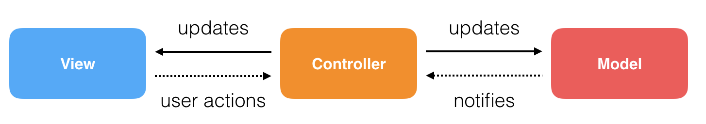
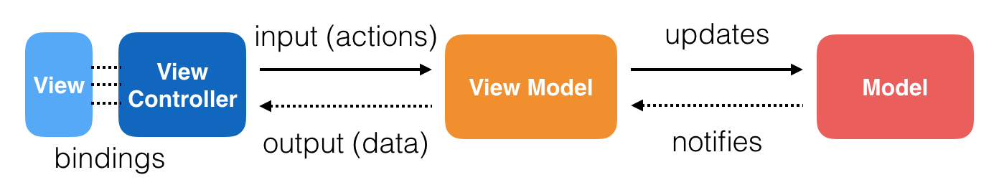
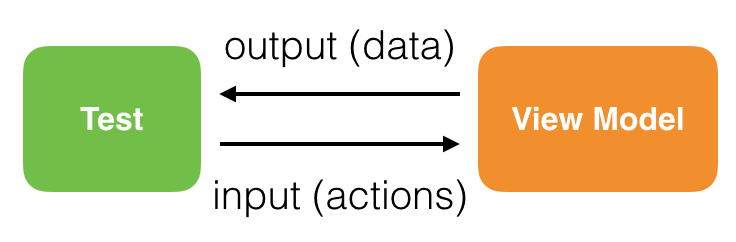
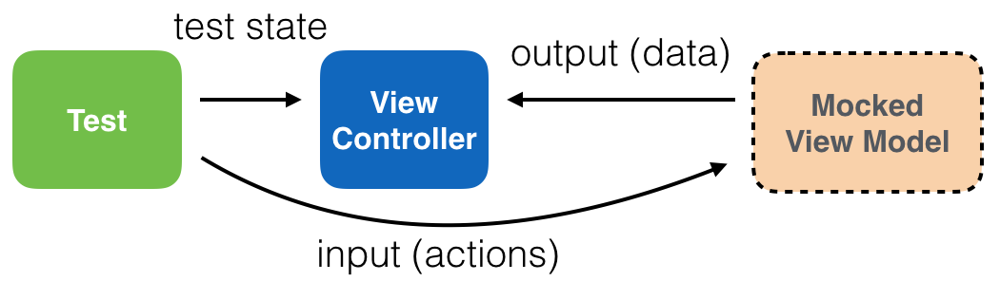
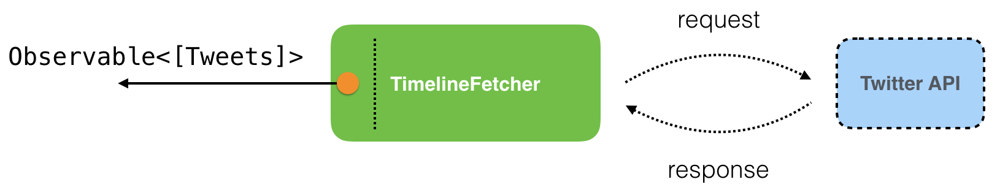
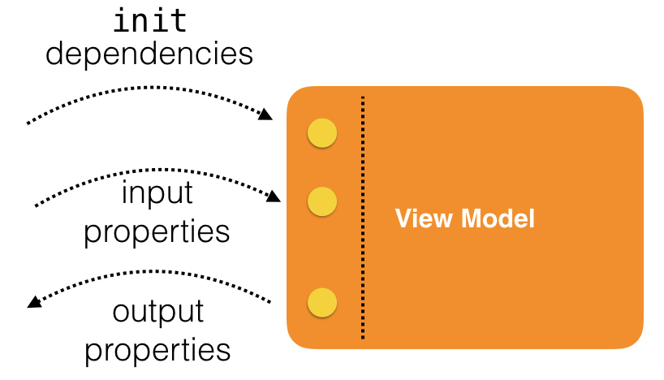

#24장 MVVM with RxSwift

RxSwift는 매우 방대한 주제라서 어플리케이션 아키텍처의 어떤 것도 아직 다루지 않았다. 이는 주로 RxSwift가 어떤 특정한 아키텍처를 앱에 강요하지 않기 때문이다. 그런데, RxSwift와 MVVM패턴과 함께 잘 작동하기 때문에 이번 장에서는 특정 아키텍처 패턴에 대한 논의에 전념하겠음

&nbsp;

[TOC]

&nbsp;

## 1. Introducing MVVM

MVVM은 Model-View-ViewModel을 의미한다. 애플의 전형적인 MVC(Model-View-Controller)의 약간 다른 구현이다.

&nbsp;

열린 마음으로 MVVM에 접근하는게 중요하다. MVVM은 소프트웨어 아키텍처의 만병통치약이 아니다. 오히려 MVVM을 좋은 어플리케이션 아키텍처로 한발 나아가는 소프트웨어 디자인 패턴으로 생각해라. 특히 MVC 사고방식에서 시작하는 경우에말이다.

&nbsp;

### Background on MVC

아마 MVVM과 MVC사이에 약간의 긴장감을 느꼈을 것임. 정확히 그들의 관계의 본질은 무엇일까? 둘은 매우 비슷하고 먼 사촌이라고까지 할 수 있다. 그러나 여전히 충분이 다르기 때문에 설명이 필요하다.

&nbsp;

대부분의 설명들은 코드 샘플을 위해 MVC패턴을 사용한다.

&nbsp;

MVC는 많은 간단한 앱을 위한 직관적인 패턴이며 아래와 같이 생겼다.



각 클래스는 역할을 할당 받는다. controller 클래스는 model과 view 모두를 업데이트 할 수 있는 중앙적인 역할, 반면 view는 단지 화면에 데이터를 표시하고 제스처같은 이벤트를 controller에 보낸다. 마지막으로 model은 앱 상태를 유지하기 위해 데이터를 읽고 쓴다.

&nbsp;

MVC는 한동안 잘 사용할 수 있는 간단한 패턴이지만 앱이 커져가면서 많은 클래스들이 view도 model도 아닌 controller여야 한다는 것을 알아차릴 것임.  빠지기 쉬운 흔한 함정은 점점 더 많은 코드를 하나의 controller 클래스에 추가하는 것임. View controller로 iOS 앱을 시작하기 때문에, 가장 쉬운 건 코드를 view controller 클래스에 욱여넣는 것임. 따라서 MVC가 "Massive View Controller"를 의미 한다는 농담도 있다. 왜냐하면 컨트롤러가 수백 수천줄까지 확장 될 수 있기 때문.

&nbsp;

클래스를 과적하는건 단순히 나쁜 습관이며 MVC 패턴의 필연적인 단점은 아니다. 좋은 사례로 많은 애플 개발자들은 MVC 패턴의 팬이며 놀랍도록 잘 만들어진 macOS나 iOS 소프트웨어로 밝혀졌다.

&nbsp;

###MVVM to the rescue

MVVM은 MVC와 매우 닮아있지만 분명히 더 낫다. MVC를 좋아하는 사람들은 대개 MVVM을 사랑한다. 이 새로운 패턴이 MVC패턴의 많은 일반적인 문제들을 쉽게 해결했기 때문에.

&nbsp;

MVC로 부터 확실히 다른건 ViewModel이라는 새로운 카테고리이다.



ViewModel은 아키텍처에서 중심적인 역할을 한다. 비즈니스 로직을 다루고 model과 view 양쪽과 통신한다.

MVVM은 아래 간단한 규칙을 따른다.

* Models은 데이터 변경에 관해 알림을 방출할 수 있을지라도 다른 클래스와 직접 소통하지 않는다.
* View Models은 Models과 얘기하고 ViewController에 데이터를 노출한다.
* View Controller는 View Models와 Views하고 얘기하며 view의 생명주기를 다루고 data를 UI 요소에 묶는다.
* Views는 단지 view controller에게 이벤트에 관해 알린다.(MVC와 같다)

잠깐, View Model이 MVC의 contoller가 하던 일을 하고 있지 않나? 그렇기도 하고 아니기도 하다.

&nbsp;

앞서 말한대로, 일반적인 문제는 view controller를 뷰 자체를 제어하지 않는 코드들로 채우는 것이다. MVVM은 view controller를 view와 함께 묶고 view를 통제하는 단일 책임을 할당함으로써 이 문제를 해결하려고 한다.

&nbsp;

MVVM 아키텍처의 또 다른 장점은 테스트 가능한 코드의 증가이다. view 생명주기를 비즈니스 로직으로부터 분리하는 것은 view controller와 view model 양쪽 테스트를 직관적으로 만들었다.

&nbsp;

마지막으로, view model은 프레젠테이션 레이어로부터 완전히 분리되어서 필요하다면 플랫폼간에 재사용 될 수 있다. 단지 view-view controller 짝을 교체하고 iOS에서 macOS나 tvOS로 이식할 수 있다.

&nbsp;

###Deciding what goes where

그런데, 다른 모든 것이 View Model 클래스에 들어가야 한다고 가정하지 말아라.

아마 때로 MVC에서 끝난 것과 같은 광기와 같다. 다시 말해 Massive View Model이 된다는 뜻.

책임을 코드 전반에 걸쳐 센스있게 나누고 할당하는 것은 개발자에게 달려있다. 따라서 View Model을 데이터와 화면 사이의 뇌처럼 두지만 네트워킹, 화면이동, 캐시 그리고 비슷한 책임들은 다른 클래스로 확실히 나누자.

&nbsp;

그래서 만약 이들 다른 클래스들이 MVVM 범주에 속하지 않는다면 어떻게 작업 할 것인가? MVVM은 어떻게 작업하는지에 관해 강제하지 않지만 지금부터 가능한 방법으로 작업해볼것임.

&nbsp;

한 가지 좋은 생각은 View Model이 필요로 하는 모든 객체를 init 단계나 가능한 다른 생명주기 때 주입하는 것이다.

이건 API 클래스 같이 수명이 긴 객체나 영속성 레이어의 객체를 view model에서 view model로 전달 할 수 있음을 의미한다.


이번 장에서는 이런 방식으로 앱 화면이동을 다루는 Navigator나 현재 로그인한 계정을 가져오는 API같은 것들을 전달 할 것임.

&nbsp;

그러나 작은 파일들이 MVVM의 유일한 장점일까? 제대로 사용하면 MVVM패턴을 통해 기존 MVC를 개선 할 수 있다.

* View controllers는 훨씬 단순한 경향이 있고 이름에 걸맞다. 왜냐하면 유일한 책임이 view를 "control"하는 것 이시 때문에. MVVM은 특히 observable을 UI 컴포넌트에 묶도록 하는 RxSwift/RxCocoa와 잘 작동한다. observable과 UI 컴포넌트를 bind하는건 이 패턴을 위한 핵심 역할이다. 왜냐면 MVVM패턴에서 View는 View Model의 변경을 일방적으로 관찰하고 화면에 반영하는데 bind로 간단히 구현 할 수 있다.

* View models은 명확한 Input -> Output 패턴을 따르며 예상된 출력에 대해 사전 정의된 입력 및 테스트를 제공함으로 테스트하기 쉽다.




* 예상된 view controller 상태에 대해 mock view model과 테스트를 생성함으로써 시각적으로 view controllers를 테스트하는게 훨씬 쉬워졌다.



마지막으로, MVVM은 MVC에서 크게 벗어나기 때문에, 추가적인 소프트웨어 아키텍처 패턴을 탐색하도록 영감을 준다.

&nbsp;

MVVM를 시도해보고 싶다면 이번 장을 통해 많은 장점을 보게 될것임

&nbsp;

&nbsp;

## 2. Getting started with Tweetie

Tweetie라는 프로젝트를 가지고 작업해볼 것임. 이 프로젝트는 macOS와 iOS 타겟을 가지며 MVVM 패턴을 이용해 실제 프로그래밍하며 발생하는 많은 문제들을 해결한다. MVVM과 관련된 코드에 집중하자.

&nbsp;

이번 장을 진행하면서 어떻게 MVVM 패턴이 아래 두 가지에 명확한 구분을 제공하는지 보게 될것임.

* iOS용 UIKit을 사용하는 뷰 컨트롤러나 AppKit을 사용하는 별도의 macOS 전용 뷰 컨트롤러 같이 UI와 관련되어 플랫폼에 따라 다른 코드.
* 특정 플랫폼의 UI 프레임워크에 의존하지 않아서 그대로 재사용되는 mdels과 view models 코드.

&nbsp;

###Project structure

앱을 완성시켜서 리스트안의 유저들의 트윗을 볼 수 있도록 만들어보자.

먼저 네트워크 레이어 완성하고 view model 클래스 작성한뒤에 iOS와 macOS를 위한 각각의 view controller 생성후 앞서 완성한 view model 이용해서 데이터를 화면에 나타낼 것임.

다양한 클래스에서 작업하고 MVVM을 직접 경험하게 될것임.

&nbsp;

###Finishing up the network layer

프로젝트의 네트워킹 부분을 완성시켜보자. 

```swift
let feedCursor = BehaviorRelay<TimelineCursor>(value: .none)

/// 1...
timeline = reachableTimerWithAccount
    .withLatestFrom(feedCursor.asObservable()) { account, cursor in
        return (account: account, cursor: cursor)
    }
		.flatMapLatest(jsonProvider) /// 2...
		.map(Tweet.unboxMany) /// 3...
		.share(replay: 1)
```

/// 1... reachableTimerWithAccount 타이머 옵저버블을 feedCursor와 결합한다. feedCursor는 timeline의 현재 포지션을 저장하기 위해 사용됨

/// 2... 메소드 매개변수 jsonProvider를 flatmapping한다. jsonProvider는 초기화때 주입된 클로저이며 엔드포인트마다 다른 녀석을 주입받기 때문에 if 문을 피할 수 있다.

/// 3... jsonProvider는 Observable<[JSONObject]>를 리턴하기때문에 다음 단계는 Observable<[Tweet]>으로 매핑하는 것임. JSONObject에서 tweet 배열로 변환을 시도하는 Tweet.unboxMany를 이용함.

&nbsp;

몇 줄의 코드로 tweets을 가져올 준비가 됐다. timeline은 public observable이기 때문에 view model이 이 최신 tweets 리스트에 접근 할 것임.

&nbsp;

앱의 view model은 tweets을 디스크에 저장하거나 바로 사용해서 앱의 UI에 나타낼 수 있지만 이건 전적으로 view model 스스로의 일이다. 신경 쓸 바가 아니다.

&nbsp;

TimelineFetcher는 단순히 tweets을 가져와서 결과를 노출한다.




타이머 옵저버블때문에 구독이 반복적으로 호출되기 때문에 현재 포지션(혹은 커서)를 저장해서 같은 tweets을 계속 다시 가져오지 않도록 할 필요가 있다. 

```swift
timeline
  .scan(.none, accumulator: TimelineFetcher.currentCursor)
  .bind(to: feedCursor)
  .disposed(by: bag)
```

feedCursor는 TimelineFetcher의 프로퍼티이며 BehaviorRelay<TimelineCursor> 타입이다(기본값을 가지며 next이벤트만 방출). TimeCursor는 지금까지 가져온 tweets의 가장 오래된, 가장 최신의 tweet ID를 각각 갖고 있는 커스텀 structure이다.

&nbsp;

이전 코드에서 ID를 추적하기 위해 scan을 사용했다. 새로운 tweets 리스트를 얻을때 마다 feedCursr의 값을 업데이트한다.

&nbsp;

주의: cursor 로직을 자세히 다루지는 않는다. 왜냐하면 Twitter API에 특화된 로직이기 때문에.

&nbsp;

다음으로 view model을 생성하자. API로부터 최신 tweets을 가져오기 위해 방금 완성한 TimelineFetcher 클래스를 사용할 것임

&nbsp;

&nbsp;

##3. Adding a View Model

이미 화면이동 클래스나 데이터 엔티티, 트위터 계정 접근 클래스 등이 만들어져 있음. 이제 네트워크 레이어가 완성되었으니 트위터에 로그인하고 tweets을 가져오기 위해 이것들을 간단하게 결합 할 수 있다.


controller에 대해서는 고려하지 않을 것임. (유일한 방법은 아니지만) view model 코드에서 아래 세 가지의 섹션을 명확하게 정의하는 것이 좋은 방법이다.

1. Init: 모든 의존성을 주입하는 하나 이상의 inits를 정의한다.
2. Input: view controller가 input을 제공할 수 있도록 하는 일반 변수나 RxSwift subject/relay 같은 공용 속성을 포함한다.
3. Output: (대개 Observable이나 Driver) view model의 output을 제공하는 공용 속성을 포함한다. 이것들은 주로 테이블뷰나 컬렉션뷰를 작동시키기 위한 객체 리스트이거나 앱의 UI를 작동시키기 위해 view controller가 사용하는 다른 유형의 데이터이다.



지금 추가할 view model ListTimeLineViewModel은 fetcher 프로퍼티를 초기화하는 init 코드가 구현되어 있다. fetcher는 tweets을 가져오기 위해 위에서 완성한 네트워크 레이어 TImelineFetcher의 인스턴스이다.


view model에 프로퍼티를 추가할 시간이다. 먼저 아래 두 프로퍼티를 추가하는데 이 프로퍼티들은 input이나 output은 아니지만 주입된 의존성을 유지하는데 도움을 준다.

```swift
let list: ListIdentifier
let account: Driver<TwitterAccount.AccountStatus>
```

상수이기 때문에 그것들을 초기화할 유일한 기회는 init에 있다.  다음 코드를 클래스의 생성자에 추가하자.

```swift
self.account = account
self.list = list
```


이제 input 프로퍼티를 추가할 수 있다. 이미 이 클래스의 모든 의존성을 주입했는데 어떤 프로퍼티가 추가 되어야 할까? 주입된 의존성과 init에 제공한 매개변수는 초기화 때 input을 제공하도록 한다. 다른 공용 프로퍼티는 view model의 생애동안 언제든지 input을 제공하도록 할것임.


예를 들면 유저가 데이터베이스를 검색하는 앱을 생각해봐라. 검색 텍스트 필드를 view model의 input 프로퍼티에 연결할 것이다. 검색어가 바뀜에 따라 view model은 데이터베이스를 검색하고 output을 그에 따라서 바꿀 것이다. output은 차례로 결과를 표시하기 위한 테이블 뷰에 바인딩 될 것이다.


현재 view model에서 가질 유일한 input은 timeline fetcher 클래스를 일시중지하고 재개하도록 할 수 있는 프로퍼티이다. TimelineFetcher 클래스는 이미 그걸 하기 위한 BehaviorRelay<Bool> 기능이 있어서 view model에 proxy 프로퍼티가 필요할 것임. 


View model의 input으로 아래 코드를 추가하자.

```swift
var paused: Bool = false {
  didSet {
    fetcher.paused.accept(paused)
  }
}
```

이 프로퍼티는 fetcher 클래스의 paused 값을 설정하는 간단한 프록시다. 


이제 view model의 ouput으로 이동하자. view model은 가져온 tweets 리스트와 로그인 상태를 노출시킬 것임. tweets 리스트는 Realm(iOS에서 데이터를 저장하기 위한 도구)에서 불러온 tweet 객체의 옵저버블 시퀀스가 될것이고 로그인 상태는 유저가 현재 트위터에 로그인 했는지 여부를 나타내기 위해 false나 true를 방출하는 Driver<Bool> 일것임.


Output으로 다음 두 프로퍼티를 추가하자.

```swift
private(set) var tweets: Observable<(AnyRealmCollection<Tweet>, RealmChangeset?)>!
private(set) var loggedIn: Driver<Bool>!
```

tweets에는 최신 Tweet 객체 리스트가 포함된다. 유저가 그들의 트위터 계정에 로그인 하기 전처럼 tweets들이 불러와지기 전에, 기본 값은 nil이 될것임. loggedIn은 나중에 초기화 할 Driver이다.


이제 TimelienFetcher의 결과를 구독하고 tweets를 Realm에 저장 할 수 있다. 물론 RxRealm을 사용하면 꽤 쉽다. init에 아래 코드를 추가하자.

```swift
fetcher = TimelineFetcher(account: account, list: list, apiType: apiType)

fetcher.timeline
  .subscribe(Realm.rx.add(update: .all))
  .disposed(by: bag)
```

Observable<[Tweet]>타입인 fetcher.timeline을 구독하고 결과(tweets의 리스트)를 Realm.rx.add(update:)에 바인딩한다.

Realm.rx.add는 앱의 기본 Realm 데이터베이스에 객체들을 저장한다.


추가한 코드는 view model의 데이터 유입을 처리하므로 남은건 view model의 ouput을 빌드하는 것임. bindOutput 메소드에 아래 코드를 추가하자.

```swift
guard let realm = try? Realm() else {
  return
}
tweets = Observable.changeset(from: realm.objects(Tweet.self))
```

Realm의 Result의 도움으로 얼마나 쉽게 옵저버블 시퀀스를 만들 수 있는지 볼 수 있다. 위 코드에서 저장된 tweets으로 일련의 result를 만들고 컬렉션의 변화를 구독했다. tweets 옵저버블은 view controller같은 이해 관계자에게 노출된다.


다음으로 loggedIn ouput 프로퍼티를 신경써야 한다. 간단하게 account를 구독하고 요소들을 true나 false로 매핑할것임. 
```swift
loggedIn = account
  .map { status in
    switch status {
    case .unavailable: return false
    case .authorized: return true
    }
  }
  .asDriver(onErrorJustReturn: false)
```

이렇게 view model에 필요한 것들을 구현했다. init 안에서 모든 의존성을 주입하는것을 신경썼고 다른 클래스에서 input을 제공하기위한 몇몇 프로퍼티들을 추가했다. 그리고 마지막으로 view model의 result를 다른 클래스가 관찰 할 수 있는 공용 프로퍼티와 바인딩했다.


보이듯이 view model은 view conroller, views, 생성자에서 주입받지 않은 다른 클래스들에 대해 어떤것도 알지 못한다. view model은 나머지 코드로부터 잘 격리되어있기 때문에 화면에서 어떤 output을 보기도 전에 잘 작동하는지 테스트를 진행 할 수도 있다. 


##Adding a View Model test


